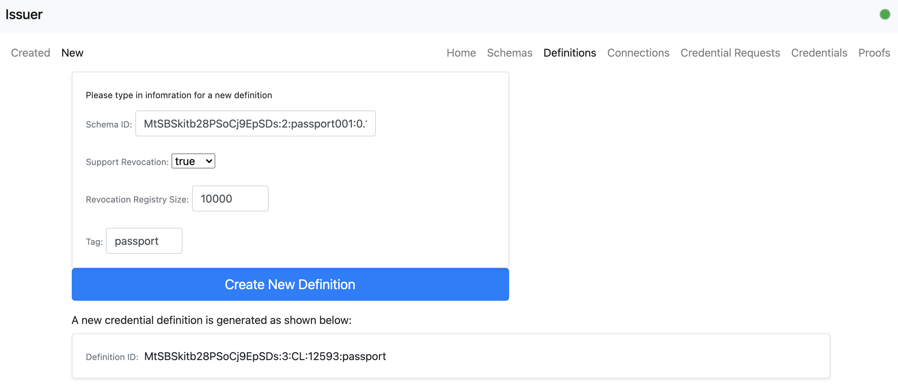
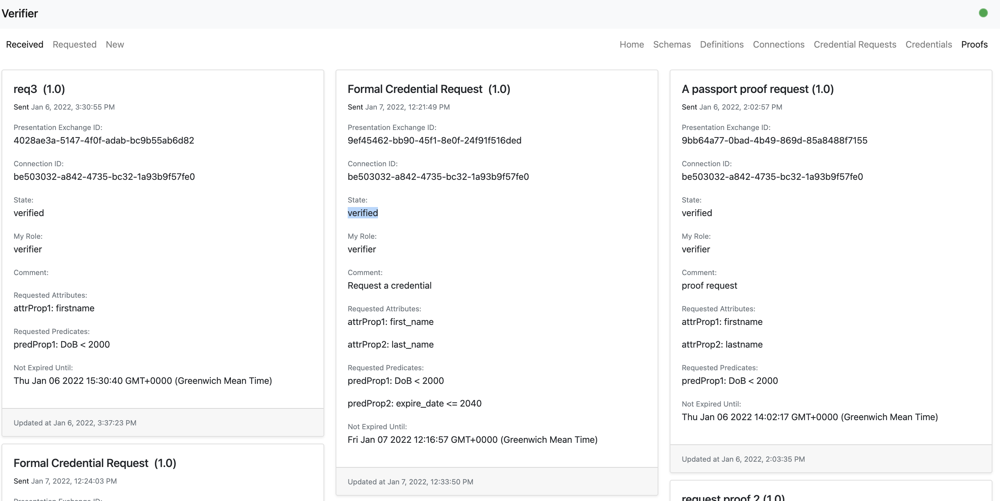

## Repo Description
This repo is mainly used to run as 3 frontend controller apps that each connects to a local Hyperledger ACA-Py agent as an issuer, holder and verifier respectively. It's built upon the alice-controller Angular app in [Hyperledger's aries-acapy-controllers repo](https://github.com/hyperledger/aries-acapy-controllers/tree/main/AliceFaberAcmeDemo/controllers).

## Bilanguage Support
The Web UI of the apps in this repo supports both English and Simplified Chinese (简体中文). 

## Prerequisites
1. OS: MacOS 11.6.1 (properly tested) or Unix/Linux(not properly tested yet).
2. Node version: 14.18.1.
3. Angular version: 12.2.13.
4. Docker Version: 20.10.8, build 3967b7d. Docker is optional, it is only needed when running ACA-Py agents in the same local machine of the frontend app is required.
5. Docker Compose Version: 1.29.2, build 5becea4c. Docker is also optional, it is only needed when running ACA-Py agents in the same local machine of the frontend app is required.

## Known Issues
1. Currently, the frontend app can work with ACA-Py <b>V0.6.0</b> only. There're issues of using this frontend app when it's tested against ACA-Py <b>V0.7.0</b> and above, and it will fail when a holder user sends a proof presentation.
2. As a simple demo, data validation (e.g. user's input data) and error handling have not been implemented.

## Repo Structure
<pre>
|__ <b>acapy</b>: This folder contains all shell scripts to set up 3 ACA-Py agents with version 0.6.0.
|__ <b>agent-specifc</b>: This folder contains some frontend pages customised for an holder and a verifier.
|__ <b>agent</b>: This folder contains all the frontend app files.
|__ <b>images</b>: This folder contains images of user guidance in the README file.
|__ <b>azure-pipelines.yml</b>: This is the pipeline file used in Azure DevOps pipelines. It's currently being tested for my own private Cloud environment. A user runs this repo in a local machine can quickly ignore it.
|__ <b>common.sh</b>: This shell script defines the styling of information printed out. It is used by other shell script files.
|__ <b>setup-agent.sh</b>: This shell script will auto create 3 frontend apps for an issuer, a holder and a verifier respectively.
</pre>

## Run the ACA-Py Agents in Azure VMs
Please follow [my blog series](https://yunxi-zhang-75627.medium.com/hyperledger-aries-aca-py-agents-setup-and-running-tutorials-part-i-hyperledger-indy-project-249591521e92) on how to set up ACA-Py agents in Azure.

## Run the ACA-Py Agents in A Local Machine
There are two approahces provided in this repo. 
### Approach 1 - Run 3 Shell Scripts
3 seperate Shell scripts are provided in the folder named "acapy". Run them each in a separate terminal window is recommended, as this will give a clear log view for each of them. The ACA-Py agent's version used is <b>V0.6.0.</b><br>

The 3 agents will use the docker "bridge" network by default and hardcoded container-level IPs for each. The IPs should correspond to the running containers if one runs them in the right order; otherwise, the user has to update these IPs to correspond to the real IPs used in the running containers.<br>
 
By default, the issuer uses the Sovrin's BuilderNet (a Dev Indy DLT network), so a user doesn't need to run a local Indy DLT (e.g. VON-Network) in the same local machine. However, in order to enable the credential revocation, a user still needs to run a seperate tails-file server in the same machine or somewhere else that can be accessed by the ACA-Py agents.

<b>Note</b>: connecting the issuer to the Sorvin's BuilderNet requires all network traffic to be allowed to flow to the <b>Internet</b> via a specific port range:<b>9700-9799</b>. If this is not possible in the network you use, you could consider to set up a local [VON-Network](https://github.com/bcgov/von-network) in your local machine to get around it.

| Agent      | Container IP | Agent Level Communication Port | Admin(REST API) Port |
| ----------- | ----------- | ----------- | ----------- |
| Issuer | 172.17.0.2 | 7000 | 7001 |
| Holder | 172.17.0.3 | 8000 | 8001 |
| Verifier | 172.17.0.4 | 9000 | 9001 |

1. Move to the right folder
```
cd ./acapy
```
2. Open a first terminal, and run the command to have an issuer agent 
```
./runIssuer.sh
```
3. Open a second terminal, and run the command to have an holder agent 
```
./runHolder.sh
```
4. Open a third terminal, and run the command to have an verifier agent 
```
./runVerifier.sh
```

As the issuer agent connects to Sovrin's BuilderNet, for the first time connection, it requires a manual interaction to approve Transaction Author Agreement (TAA). A user only needs to press the "Enter" key to choose the default option as all these options proivision the same functionalities from a technical perspective. 

### Approach 2 - Run a docker compose file to have 3 agents to run in the same terminal window (as no ledger is configured in the docker compose file, only for the purpose of testing agent-level interaction)
By default, the 3 agents are not connecting to any Indy DLT networks. This approach is only used for testing the inter communication between agents only. 
1. Move to the right folder
```
cd ./acapy
```
2. Open a first terminal, and run the command to have 3 agents to run
```
docker-compose up
```

## Run A Indy Tails Server as Credential Revocation Registry
The Indy tails server is a docker image built based on the offical Indy tails server's docker file and pushed to my personal docker hub account. It uses the docker's built-in bridge network that will habe the 3 ACA-Py agents together. It is assumed this Indy tails server will run with a docker IP:<b>172.17.0.5</b>, which is hardcoded in the runIssuer.sh file for running an Issuer agent.<br>

Run the command to set up a indy tails server.
```
./acapy/runIndyTailsServer.sh
```

## Run the Frontend App
The agent folder contains all the files used for a forntend app. It is used as a template folder to set up all 3 frontend apps for issuer, holder and verifier respectively. A shell script file named "setup-agent.sh" is provioned to auto set up 3 frontend apps. For windows users, one has to either manually follow the commands or create a bat file unfortunately. The 3 frontend apps have been configured to auto open a new browser to show each Web UI when it's ready, which normally takes around 1 minute.
1. Run setup-agent.sh
```
./setup-agent.sh

```
Below shows the port numbers used for each frontend app.
| Frontend App | Frontend Port |  
| ----------- | ----------- | 
| Issuer |  4000 |
| Holder | 4001 |
| Verifier | 4002 |

## User Gudiance
Currently, this repo can only support a simple happy path for using ACA-Py <b>V0.6.0</b>. This includes: 
1. A Landing page  that shows 6 options to a user. Not all functions can be used for all the users. For instance, schemas and definitions can only be used for an issuer user where a public DID is provisioned to the issuer agent. Since this repo is used for demo purpose, functions catering for a specific agent user is not implemented yet.

2. An issuer user can create a new credential schema. 

3. An issuer user can then view the newly created credential schema. 

4. An issuer user can create a new definition based on the schema.

5. An issuer user can view the newly created definition.

6. An holder user can establish a new connection with the issuer user.

7. The issuer user accept the connection invitation by copying the invite JSON from the holder user and paste it in.

8. The issuer/holder user can view the established connection.

9. The holder user can send a new credential request.


10. The holder user can view the newly credential request known as a credential proposal.

11. The issuer user can approve the credential proposal by mapping the request to a specific schema and definition.

12. The holder user can now request a formal credential request.

13. The issuer user can now offically issue a formal credential.

14. The holder user can store the issued credential to a wallet.

15. The holder user can view the credential in the wallet by refreshing the page. The credential now has its own ID.

16. A verifier user can request a proof request. 


17. An holder user can choose credentials to give a proof presentation.

18. A verifier user can verify a proof.

19. After refreshing the page, the verifier user can see the proof has been successfully verified as it is reflected in the state field.
